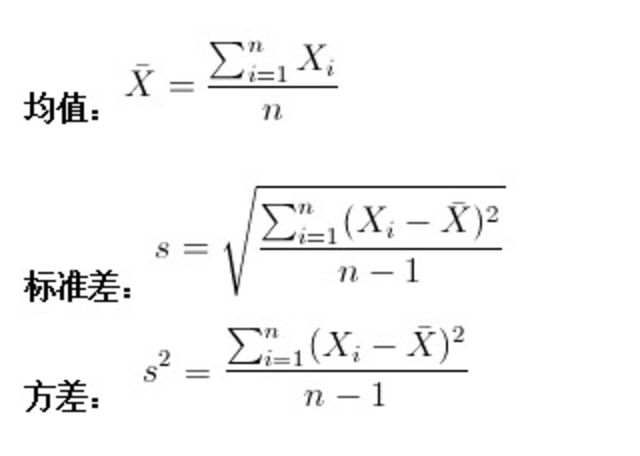
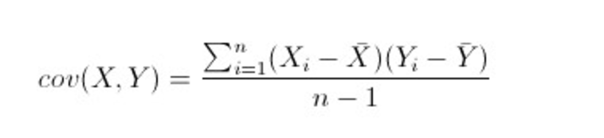

# 方差，协方差，协方差矩阵, 去中心化, whiting, dewhiting
参考:http://blog.csdn.net/kuang_liu/article/details/16369475
    http://blog.csdn.net/beechina/article/details/51074750

## 平均值
  描述样本的中点

## 方差
  描述样本的集中程度，样本集合各个样本点到中点的距离的平均值得平方

## 协方差(convariance)
  
  各个维度的参数之间的相关性. 正：正相关，负：负相关，0：相对独立

## 协方差矩阵(convariance matrix)
  多维度的协方差

  计算方法:
      * 1.各个维度去中心化，即减去各维度的平均值,使各个维度的平均值都为0, 得到矩阵 X
      * 2. Cov = X * X.T / (m - 1)

# restricted Boltzmann machine, RBM

## 配分函数, 条件独立
## 对比分歧（contrastive divergence，CD）算法

# Deep belief network
