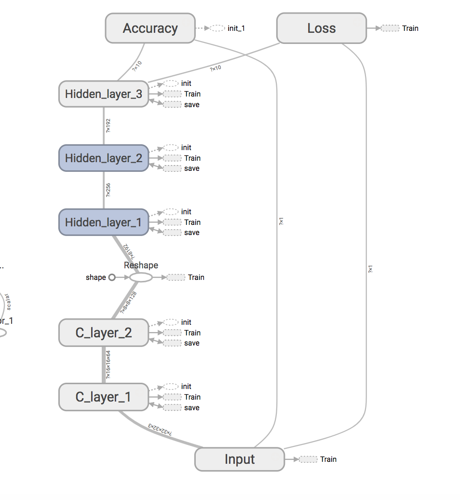

# CIFAR-10
## 1.about CIFAR-10
   用于训练分类的数据库，一共10种分类。
   地址：http://www.cs.toronto.edu/~kriz/cifar.html

## 2.模型
  

  如图所示，当前使用的结构为 
  (C + MP) * 2 + F*3  
  > (C: convolutional卷积层, MP: maxpooling, F: full connect)

## 3.结果
  * 2017-09-17 Accuracy : 62% 用时4h
  * To be continued
