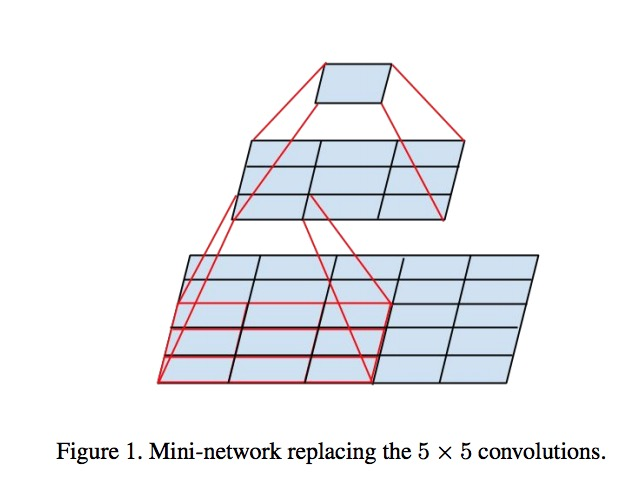

# Introduction
>Convolutional networks are at the core of most stateof-the-art
computer vision solutions for a wide variety of
tasks. Since 2014 very deep convolutional networks started
to become mainstream, yielding substantial gains in various
benchmarks. Although increased model size and computational
cost tend to translate to immediate quality gains
for most tasks (as long as enough labeled data is provided
for training), computational efficiency and low parameter
count are still enabling factors for various use cases such as
mobile vision and big-data scenarios. Here we are exploring
ways to scale up networks in ways that aim at utilizing
the added computation as efficiently as possible by suitably
factorized convolutions and aggressive regularization. We
benchmark our methods on the ILSVRC 2012 classification
challenge validation set demonstrate substantial gains over
the state of the art: 21.2% top-1 and 5.6% top-5 error for
single frame evaluation using a network with a computational
cost of 5 billion multiply-adds per inference and with
using less than 25 million parameters. With an ensemble of
4 models and multi-crop evaluation, we report 3.5% top-5
error and 17.3% top-1 error

卷积神经网络是目前计算机解决多种多样任务的核心。自从2014年深度的卷积网络成为主流，产生了大量的不同的分支。尽管在大多数任务中增加的模型大小和计算耗费趋于能迅速得到高质量的回报，计算的效率和少量的参数依然能有效作用于很多场景。例如手机和大数据。这里我们探索一种方法能够有效率的计算的放大网络。通过分解卷积模型和积极的正则化。

# Factorization convolution

如图将一个5*5的卷积转化为2个3*3的卷积
则参数变为原来的 (3*3 + 3*3)/(5*5) = 72%
但是深度却增加了

#引用:
* Rethinking the Inception Architecture for Computer Vision https://arxiv.org/pdf/1512.00567.pdf
