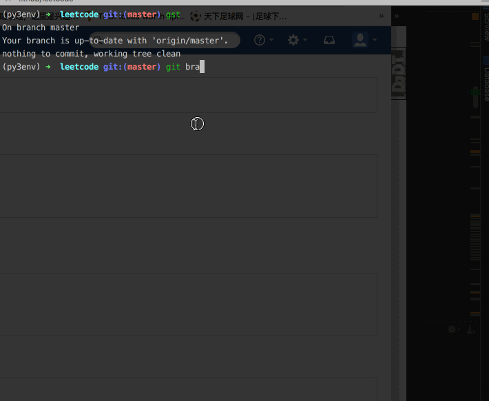
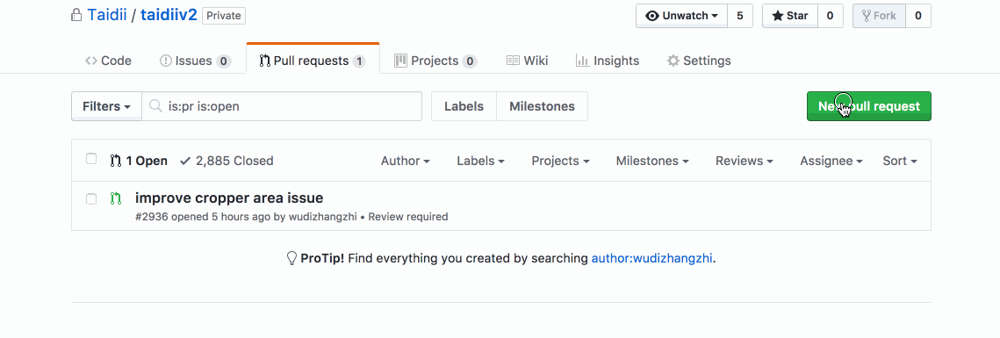

# Django练习
## 实现一个博客网站。
  与当前浏览的网站类似，但也多一些附加功能
  1. 登录登出功能
  2. 登录后可以编辑博客的功能
  3. 浏览博客的功能

# GitFlow
## 1.概览


## 2.当前分支master
```
git pull --rebase master
```

## 3.第一次开始任务 TDP-xxx， 创建分支,  “/”前面可用fix, feature, hotfix, 对应修改bug，新需求功能，紧急修复
```
git checkout -b feature/yourname_TDP-xxx
```

## 4.不是第一次开始任务，切换分支
```
git checkout feature/yourname_TDP-xxx
```


## 5.修改完, 提交修改
```
git add *
git commit -m'自己修改的内容的描述'
git push origin feature/yourname_TDP-xxx
```

## 6.自己本地测试完后线上测试,合并， merge, 切换到 dev分支, 并更新dev分支到最新
```
git checkout dev
git pull --rebase origin dev
git merge --no-ff feature/yourname_TDP-xxx
```
## 7.成功后
```
git push origin dev
```


## 8.在dev上查看自己修改是否成功, 如果没有问题，在gihub上创建pull request



# 一些python的练习
## 1. Add Digits
```
'''
 Given a non-negative integer num, repeatedly add all its digits until the result has only one digit.

For example:

Given num = 38, the process is like: 3 + 8 = 11, 1 + 1 = 2. Since 2 has only one digit, return it.

Follow up:
Could you do it without any loop/recursion in O(1) runtime?
'''

class Solution(object):
    def addDigits(self, num):
      pass
```
### My solution
```
class Solution(object):
    def addDigits(self, num):
      if num==0:
        return 0
      return num % 9 if num % 9 !=0 else 9

    def addDigits(self, num):
      if num==0:
        return 0
      return (num - 1) % 9 + 1

    # 迭代
    def addDigits(self, num):
      return num if num < 10 else self.addDigits(reduce(lambad x,y: int(x) + int(y), list(str(num))))
```


## 2. array partition i
```
'''
 Given an array of 2n integers, your task is to group these integers
 into n pairs of integer, say (a1, b1), (a2, b2), ..., (an, bn)
 which makes sum of min(ai, bi) for all i from 1 to n as large as possible.

Example 1:

Input: [1,4,3,2]

Output: 4
Explanation: n is 2, and the maximum sum of pairs is 4.

Note:

    n is a positive integer, which is in the range of [1, 10000].
    All the integers in the array will be in the range of [-10000, 10000].

'''
class Solution(object):
    def arrayPairSum(self, nums):
        """
        :type nums: List[int]
        :rtype: int
        """
        pass
```
### My solution
```
class Solution(object):
def arrayPairSum(self, nums):
    """
    :type nums: List[int]
    :rtype: int
    """
    return sum(sorted(nums)[::2])
```


## 3. detect capital
```
'''
 Given a word, you need to judge whether the usage of capitals in it is right or not.

We define the usage of capitals in a word to be right when one of the following cases holds:

    All letters in this word are capitals, like "USA".
    All letters in this word are not capitals, like "leetcode".
    Only the first letter in this word is capital if it has more than one letter, like "Google".

Otherwise, we define that this word doesn't use capitals in a right way.

Example 1:

Input: "USA"
Output: True

Example 2:

Input: "FlaG"
Output: False


'''

class Solution(object):
    def detectCapitalUse(self, word):
        """
        :type word: str
        :rtype: bool
        """
```
### My solution
```
class Solution(object):
    def detectCapitalUse(self, word):
        """
        :type word: str
        :rtype: bool
        """
        return word.isupper() or word.istitle()
```


## 4. distribute candies
```
"""
Given an integer array with even length, where different
numbers in this array represent different kinds of candies.
Each number means one candy of the corresponding kind.
You need to distribute these candies equally in number to
brother and sister. Return the maximum number of kinds of
candies the sister could gain.

Example 1:
Input: candies = [1,1,2,2,3,3]
Output: 3
Explanation:
There are three different kinds of candies (1, 2 and 3),
 and two candies for each kind.
Optimal distribution: The sister has candies [1,2,3] and
the brother has candies [1,2,3], too.
The sister has three different kinds of candies.
Example 2:
Input: candies = [1,1,2,3]
Output: 2
Explanation: For example, the sister has candies [2,3] and
the brother has candies [1,1].
The sister has two different kinds of candies, the brother
has only one kind of candies.
Note:

The length of the given array is in range [2, 10,000], and
 will be even.
The number in given array is in range [-100,000, 100,000].


class Solution(object):
    def distributeCandies(self, candies):
        """
        :type candies: List[int]
        :rtype: int
        """
```
### My solution
```
class Solution(object):
    def distributeCandies(self, candies):
        """
        :type candies: List[int]
        :rtype: int
        """
        return min(len(candies)//2, len(set(candies)))
```


## 5.two-sum-ii-input-array-is-sorted
```
'''
Given an array of integers that is already sorted in ascending order, find two numbers such that they add up to a specific target number.

The function twoSum should return indices of the two numbers such that they add up to the target, where index1 must be less than index2. Please note that your returned answers (both index1 and index2) are not zero-based.

You may assume that each input would have exactly one solution and you may not use the same element twice.

Input: numbers={2, 7, 11, 15}, target=9
Output: index1=1, index2=2
'''

class Solution(object):

    def twoSum(self, numbers, target):
        """
        :type numbers: List[int]
        :type target: int
        :rtype: List[int]
        """
```

## 6.single-number
```
'''
Given an array of integers, every element appears twice except for one. Find that single one.

Note:
Your algorithm should have a linear runtime complexity. Could you implement it without using extra memory?
'''
class Solution(object):
    def singleNumber(self, nums):
        """
        :type nums: List[int]
        :rtype: int
        """
```

## 7.reverse-words-in-a-string-iii
```
"""
Given a string, you need to reverse the order
of characters in each word within a sentence while
still preserving whitespace and initial word order.

Example 1:
Input: "Let's take LeetCode contest"
Output: "s'teL ekat edoCteeL tsetnoc"
Note: In the string, each word is separated by
single space and there will not be any extra space in the string.
"""


class Solution(object):
    def reverseWords(self, s):
        """
        :type s: str
        :rtype: str
        """
```

## 8.sum-of-left-leaves
```
'''
Find the sum of all left leaves in a given binary tree.

Example:

    3
   / \
  9  20
    /  \
   15   7

There are two left leaves in the binary tree, with values 9 and 15 respectively. Return 24.
'''

# Definition for a binary tree node.
#class TreeNode(object):
#    def __init__(self, x, left=None, right=None):
#        self.val = x
#        self.left = left
#        self.right = right

class Solution(object):
    def sumOfLeftLeaves(self, root):
      """
      :type root: TreeNode
      :rtype: int
      """
```

## 9.relative-ranks
```
'''
 Given scores of N athletes, find their relative ranks and the people with the top three highest scores, who will be awarded medals: "Gold Medal", "Silver Medal" and "Bronze Medal".

Example 1:

Input: [5, 4, 3, 2, 1]
Output: ["Gold Medal", "Silver Medal", "Bronze Medal", "4", "5"]
Explanation: The first three athletes got the top three highest scores, so they got "Gold Medal", "Silver Medal" and "Bronze Medal".
For the left two athletes, you just need to output their relative ranks according to their scores.

Note:

    N is a positive integer and won't exceed 10,000.
    All the scores of athletes are guaranteed to be unique.

'''


class Solution(object):
    def findRelativeRanks(self, nums):
        """
        :type nums: List[int]
        :rtype: List[str]
        """
```

## 10.ransom-note
```
'''
 Given an arbitrary ransom note string and another string containing letters
  from all the magazines, write a function that will return true if the ransom
  note can be constructed from the magazines ; otherwise, it will return false.

Each letter in the magazine string can only be used once in your ransom note.

Note:
You may assume that both strings contain only lowercase letters.

canConstruct("a", "b") -> false
canConstruct("aa", "ab") -> false
canConstruct("aa", "aab") -> true

'''
class Solution(object):
    def canConstruct(self, ransomNote, magazine):
        """
        :type ransomNote: str
        :type magazine: str
        :rtype: bool
        """
```


## 11.matrix
```
'''
Given a matrix consists of 0 and 1, find the distance of the nearest 0 for each cell.

The distance between two adjacent cells is 1.
Example 1:
Input:

0 0 0
0 1 0
0 0 0
Output:
0 0 0
0 1 0
0 0 0
Example 2:
Input:

0 0 0
0 1 0
1 1 1
Output:
0 0 0
0 1 0
1 2 1
Note:
The number of elements of the given matrix will not exceed 10,000.
There are at least one 0 in the given matrix.
The cells are adjacent in only four directions: up, down, left and right.

'''

class Solution(object):
    def updateMatrix(self, matrix):
        """
        :type matrix: List[List[int]]
        :rtype: List[List[int]]
        """
```


## 12.1-bit-and-2-bit-characters
```
'''
We have two special characters. The first character can be represented by one bit 0. The second character can be represented by two bits (10 or 11).

Now given a string represented by several bits. Return whether the last character must be a one-bit character or not. The given string will always end with a zero.

Example 1:
Input:
bits = [1, 0, 0]
Output: True
Explanation:
The only way to decode it is two-bit character and one-bit character. So the last character is one-bit character.
Example 2:
Input:
bits = [1, 1, 1, 0]
Output: False
Explanation:
The only way to decode it is two-bit character and two-bit character. So the last character is NOT one-bit character.
Note:

1 <= len(bits) <= 1000.
bits[i] is always 0 or 1.
'''


class Solution(object):
    def isOneBitCharacter(self, bits):
        """
        :type bits: List[int]
        :rtype: bool
        """
```

## 13.132 Pattern
```
Given a sequence of n integers a1, a2, ..., an, a 132 pattern is a subsequence ai, aj, ak such that i < j < k and ai < ak < aj. Design an algorithm that takes a list of n numbers as input and checks whether there is a 132 pattern in the list.

Note: n will be less than 15,000.

Example 1:
Input: [1, 2, 3, 4]

Output: False

Explanation: There is no 132 pattern in the sequence.
Example 2:
Input: [3, 1, 4, 2]

Output: True

Explanation: There is a 132 pattern in the sequence: [1, 4, 2].
Example 3:
Input: [-1, 3, 2, 0]

Output: True

Explanation: There are three 132 patterns in the sequence: [-1, 3, 2], [-1, 3, 0] and [-1, 2, 0].

class Solution(object):
    def find132pattern(self, nums):
        """
        :type nums: List[int]
        :rtype: bool
        """
```
