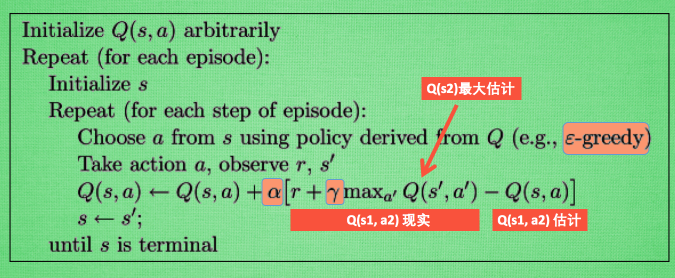
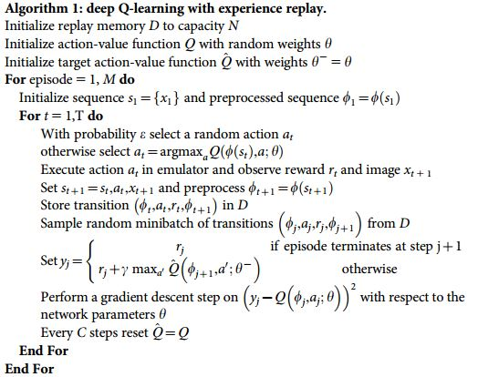

# Q-Learning
## 1.主题思想
  * 1.创建一个Q表。存放所有环境状态(S), 行动(A), 奖励(R), 后续可以根据环境查表。获取奖励最大的行动
  * 2.初始化环境
  * 3.获取环境的状态 observation (s)
  * 4.查Q表获得行动 action (a)
  * 5.用action 去更新环境, 获得新的状态 observation_ (s_) 和 奖励 reward (r) .得 Q现实 = reward + gamma * Q_max(observation_, action_)。 其中Q_max(observation_, action_)为查Q表获得的下一步最大的奖励的值
  * 6.用action 去查询Q表。获得 Q估计 = Q(s, a)
  * 7.error = Q现实 - Q估计
  * 8.利用梯度下降或者其他activation不断学习，降低error。
      Q(s, a) = Q(s, a) + alpha * error

## 2.算法
  

# Sarsa
## 1.主题思想
    * 与Q-Learning类似。但是第5步中获取 Q现实不同。
      Q-learning是查询Q表获取最大的奖励reward
      sarsa是将环境代入Q表和算法中获取下一步的行动action_和奖励 Q(observation_, action_)

## 2.算法
  

## Sarsa(lambda)

## 1.算法
  

# DQN
## 1.主题思想
  * 1.与Q-learning类似，但是Q-learning方法对于状态连续的，状态数量无限多的情况不适用。所以使用神经网络代替Q表。
  类似于用一个复杂的方程代替Q表。输入环境状态 s 和 行动 a 获得 对应的奖励reward
  * 2.用2个Neural Network.一个(N_eval)用于Q现实。一个(N_target)用于Q估计。
  * 3.N_target的参数快于N_eval. N_eval用于计算Q_现实
  N_target不断训练。与N_eval的值对比。一定步数之后将N_eval的参数替换为N_target的。

## 2.算法
  
