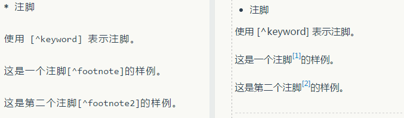
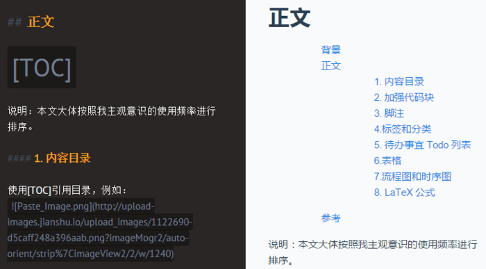
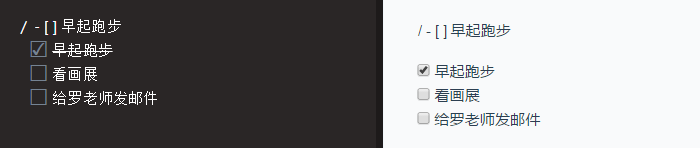
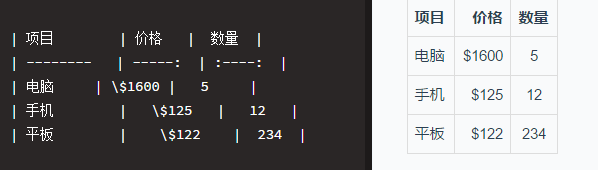
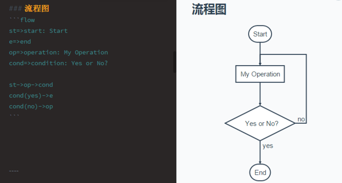
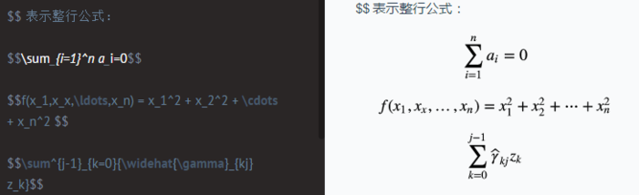

# 1.转换图片大小
```shell
convert -resize 50% old.jpg new.jpg
```

# 2.项目启动celery服务

```shell
celery worker --app=taidii  --loglevel=info --logfile=celery-worker-default-out.log

celery beat --app=taidii --loglevel=info
```
# 3.项目修改js之前

```shell
cd static/js/app/modules/
babel --presets react --watch reactSrc/ --out-dir reactBuild/
```

# 4.ssh保持连接
```
ssh -o TCPKeepAlive=yes -o ServerAliveInterval=300
```

# 5.django south
```
python manage.py syncdb
python manage.py convert_to_south appname
p
python manage.py schemagration appname --initial
python manage.py schemagration appname --auto
python manage.py migrate appname --fake 00001.xxx
python manage.py migrate appname
```

# 6. markdown 语法

## 6.1. 脚注
使用 [^keyword] 表示注脚。


## 6.2. 内容目录
使用[TOC]引用目录


## 6.3 待办事宜 Todo 列表
使用带有 [ ] 或 [x] （未完成或已完成）项的列表语法撰写一个待办事宜列表例如：


## 6.4 表格


## 6.5 流程图和时序图
  * 流程图:
  

  * 时序图:
  

## 6.6 LaTeX 公式
  * $ 表示行内公式:
  

  * $$ 表示整行公式:
  


# git 统计

```shell
# 1、统计某人的代码提交量，包括增加，删除
git log --author="$(git config --get user.name)" --since=2014-07-01 --until=2016-08-01 --pretty=tformat: --numstat | awk '{ add += $1 ; subs += $2 ; loc += $1 - $2 } END { printf "added lines: %s removed lines : %s total lines: %s\n",add,subs,loc }'

# 2、仓库提交者排名前5（如果看全部，去掉head管道即可）
git log --pretty='%aN' | sort | uniq -c | sort -k1 -n -r | head -n 5

```
