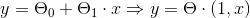
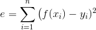
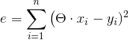
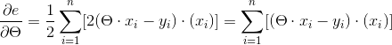
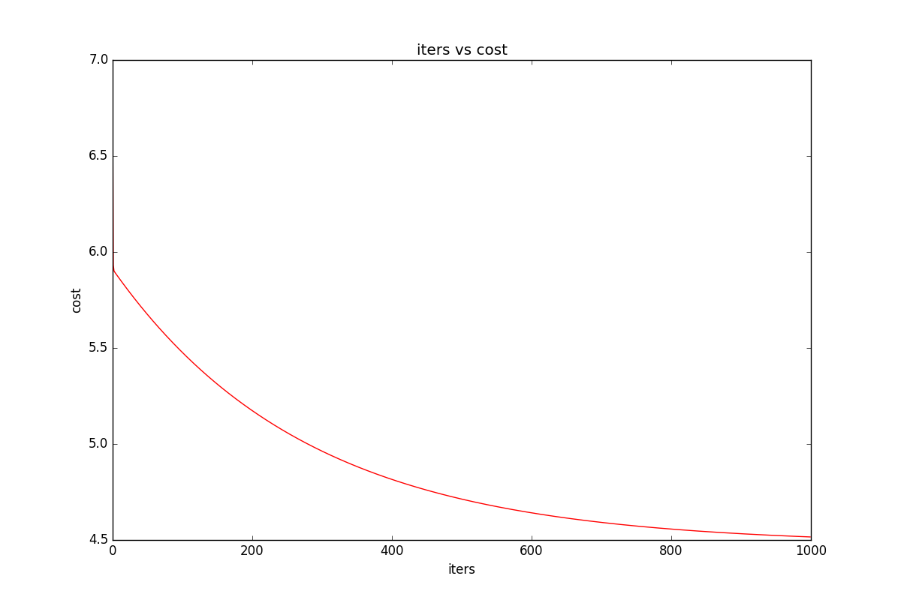

## 1. 获取数据
假设你是一家连锁店的老板，希望在另一个城市开分店，现在有一组城市的人口与利润的关系图，
通过这些数据预测不同人口的城市的利润
数据可以通过这个连接[下载](ex1data1.txt)


```python
# 导入模块
import numpy as np
import pandas as pd
import matlib.pyplot as plt

# 读取数据
data = pd.read_csv('ex1data1.txt', names=['Population','Profit'], header=None) #设置列名
# 画出数据的散点图查看
data.plot(kind='scatter', x='Population', y='Profit', figsize=(12,8))
plt.show()
```

如图:  


## 2.梯度下降

>梯度下降:
>假设 y = f(x), 求y最小值时候的x.
>则 梯度 Δ = f'(x)
>设定好一定的步长 λ
>x <-- x - λ*Δ
>代理初始的x后每次迭代x都往梯度下降的方向挪动一定的步长(其中Δ控制方向)。
>迭代多次后,当两次x带入后获取的y数值相差极小时,此时的x为最优解


## 3.实现简单的线性回归
只有一个因素影响数据, 假设直线 Y = theta0 + theta1*X1  
转换为向量的思想，则:Y = theta * (1, X)


误差计算方法:


即:


```Python
def computeCast(X, Y, theta):
  """
  计算误差的方法
  X: 输入的数据,格式：[[1,2],[1,3],[1,4]...]
  Y: 实际结果, 格式：[[1],[2],[3]...]
  theta: 参数, 向量，格式：[0,0]
  """
  error = np.sqrt(np.power(((X*theta.T) - Y), 2))
  return np.sum(error)/(len(X)*2) #TODO 为什么要多除一个2？

  # 例
  theta  = np.matrix(np.array([0,0]))
  cost = computeCast(X, Y, theta)
  print cost # 32.0727338775

```


使用梯度下降的方法调节参数theta,获取最小数据差异的结果  
具体为:

>根据复合函数求导,对误差e求theta偏导,获取梯度Δ:

> 根据梯度下降的公式:x <-- x - λ*Δ，每次迭代，重复梯度下降的过程.
> 代码流程为:
> 1. 设定初始的theta值，迭代次数iters，步长alpha
> 2. 根据 梯度下降的公式不断修改 theta
> 2. 根据迭代次数重复上一个步骤


```python
def gradientDescent(X, Y, theta, alpha, inters):
  """
  梯度下降方法
  alpha: 步长
  inters: 迭代次数
  """
  temp = np.zeros(theta.shape) # 用于缓存theta
  arguments = int(theta.ravel().shape[0]) # theta的元素数量
  cost = np.zeros(len(X)) # 用于保存每次迭代后theta所对应的误差
  for i in xrange(iters):
    error = X*theta.T - Y
    for j in xrange(arguments): # 修改参数的每一个元素
      term = np.multiply(error, X[:,j])
      temp[:,j] = theta[:,j] - (alpha/len(x)) * np.sum(term)
    theta = temp
    cost[i] = computeCast(X, Y, theta)
    return theta, cost
```
## 4. 观察结果
设定一些参数,运行
```Python
theta = np.matrix(np.array([0,0]))
alpha = 0.01
inters = 1000
g, cost = gradientDescent(X, Y,theta, alpha, iters)
print g # [[-3.24140214  1.1272942 ]]
print cost[-1] # 4.51595550308
```

根据得到的theta画出预测的直线
```python
x_array = np.linspace(data.Populcation.min(), data.Populocation.max(), 1000)
y_array = theta[:,0] + theta[:,1] * x_array
fig, ax = plt.subplots(figsize=(12,8))

ax.plot(x_array, y_array, 'r', label='Prediction') # 画出预测曲线，红色
ax.scatter(data.Populcation, data.Profit, label='traning data') # 画出训练数据
ax.legend(loc=2) # 提示，标注
ax.set_xlabel('Populocation') # 横坐标
ax.set_ylabel('Profit') # 纵坐标
ax.set_title('Predicted Profit vs. Population Size')
plt.show()
```
如图:  


## 5.查看迭代次数与误差的关系
```python
# 尝试画出 iters - cost 的曲线
fig , ax = plt.subplots(figsize=(12,8))
ax.plot(np.arange(iters), cost, 'r')
ax.set_xlabel('iters')
ax.set_ylabel('cost')
ax.set_title('iters vs cost')
plt.show()
```
如图:  

