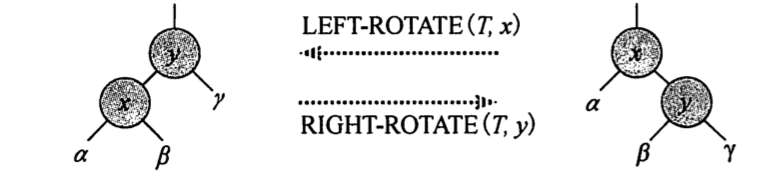

# 十三章 红黑树(red-black tree)

## 13.1 红黑树的性质

红黑树是一个二叉搜索树，增加了一个存储位保存结点的颜色， black 或者 red
树中的结点包含5个属性: color, key, left, right, p
* 1.每个结点或是红色， 或是黑色
* 2.根结点是黑色
* 3.每个叶结点(nil)都是黑色的
* 4.如果一个结点是红色， 则它的2个子结点都是黑色
* 5.对于每个结点， 到其所有后代叶结点的简单路径上，均包含相同数量的黑色结点

> 黑高: 从某个结点x出发，到达一个叶结点的任意一条简单路径上的黑色结点的个数称为该结点的黑高

> 一个有n个内部结点的红黑树高度最多为 2log(n + 1)
```
证明:
  假设红黑树的高为h，由性质4可知：从根结点到叶结点一条简单路径上至少有一半是黑色的。即：bh(x) >= h/2
  由性质4可知, 结点数量 n >= 2**bh(x) - 1
  log(n+1) >= bh(x)
  log(n+1) >= h/2
  所以：h <= 2log(n+1)
```

## 13.2 旋转(rotation)

* 左旋(left-rotation)
```
def left_rotation(T, x):
    y = x.right
    x.right = y.left
    if y.left != T.nil:
        y.left.p = x
    if x.p == T.nil:
        T.root = y
    elif x == x.p.left:
        x.p.left = y
    else:
        x.p.right = y
    x.p = y
    y.left = x
```
* 右旋(right-rotation)
```
def right_rotation(T, x):
    y = x.p
    y.left = x.right
    if x.right != nil:
        x.right.p = y
    if y.p == T.nil:
        T.root = x
    elif y.p.left == y:
        y.p.left = x
    else:
        y.p.right = x
    x.right = y
    y.p = x
```
## 13.3 插入
RB-INSERT插入结点后后需要一个辅助程序RB-INSERT-FIXUP对结点重新着色并旋转
```
def RB_INSERT(T, z):
    pass
```

## 13.4 删除
