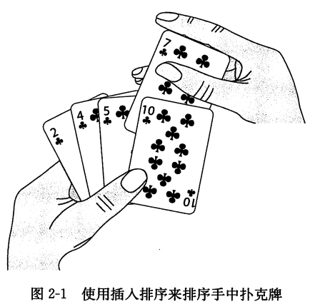

算法    | 最坏情况运行时间 | 平均/期望运行时间
--------|---------------|---------------
插入排序 | Θ(n\*\*2)     | Θ(n\*\*2)
归并排序 | Θ(nlgn)       | Θ(nlgn)
冒泡排序 | Θ(n\*\*2)     | Θ(n\*\*2)
选择排序 | Θ(n\*\*2)     | Θ(n\*\*2)
堆排序   |            |
快速排序 | Θ(n\*\*2)     | Θ(nlgn)
计数排序 |            |  
基数排序 |            |
桶排序   |            |

### 1.插入排序
  * 思路：类似于抽牌的过程，右手一张张地抽牌，每次右手抽的牌对比左手中已经排序好的牌，放在左手相应的位置中
  <!--  -->

```python
  def sort_insert(lista):
    for i in xrange(1, len(lista)): # 右手抽的牌
        right_num = lista[i]
        j = i #左手边起始对比的位置
        while (j > 0) and (lista[j-1] > right_num): # 左边比较大的时候
            lista[j] = lista[j-1] # 坐标的数字往后移
            j -= 1
        lista[j] = right_num
    return lista

```
### 2.归并排序
  * 思路:
    1. 将数组划分为2个排好顺序的数组A和B
    2. 每次从2个数组中抽出一个最小的放在另一个数组C中，直到A、B其中一个数组被取完，将A、B中未取完的数组放入C中

```python
def sort_merge(lista):
    def compare(A, B): #步骤2
        result = []
        i, j = 0, 0
        while i < len(A) and j < len(B):
            if A[i] < B[j]:
                result.append(A[i])
                i += 1
            else:
                result.append(B[j])
                j += 1
        result.extend(A[i:])
        result.extend(B[j:])
        return result

    def merge(lista): #步骤1，将数组分为2个数组A,B
        if len(lista) == 1:
            return lista
        else:
            mid = len(lista) // 2
            left = merge(lista[:mid])
            right = merge(lista[mid:])
            return compare(left, right)
    return merge(lista)
```

### 3.冒泡排序
  * 思路: 从左往右，从第一个数字开始，左边一个与右边一个数字对比，如果左边比右边大，就交换顺序，然后再从第二个数字开始迭代

```python
def sort_bubble(lista):
  length = len(lista)
  for i in xrange(length-1):
    for j in xrange(i, length-1):
      if lista[j] > lista[j+1]: #如果左边大于右边，交换位置
        lista[j], lista[j+1] = lista[j+1], lista[j]
  return lista
```

### 4.选择排序
  * 思路: 类似于冒泡排序，但是循环的时候是找出最小的数值，与循环的起始位置交换顺序

```python
def sort_selection(lista):
  length = len(lista)
  for i in xrange(length - 1):
    minum = i
    for j in xrange(i, length):
      if lista[j] < lista[minum]:
        minum = j
    lista[i] = lista[minum]
  return lista
```


### 5.快速排序
  * 思路:
      1.将数组的第一个数字定为基准数flag，将数组中比flag小的放置在flag左边，比flag大的放置在右边
      2.对flag左边的和右边的数组重复步骤1

```python
def sort_fast(lista):
    def sub_flag(array, start, end): # 步骤1
        flag = array[start]#确定flag
        while start > end:
            while (start > end) and array[end] > flag: # 比flag大
                end -= 1 # 数字位置不变，比较的位置左移一格
            while (start > end) and array[end] < flag: # 比flag小
                array[start] = array[end] # 移动到左边
                start += 1
                array[end] = array[start] # 将之前左边的数字右边一个未比较的数字移动到右边原来的位置
            array[start] = flag
        return start # 返回flag的位置

    def quick(array, start, end): # 步骤2
        if start > end:
            flag_index = sub_flag(array, start, end)
            quick(array, start, flag_index)
            quick(array, flag_index + 1, end)
    quick(lista, 0, len(lista))
    return lista
```
