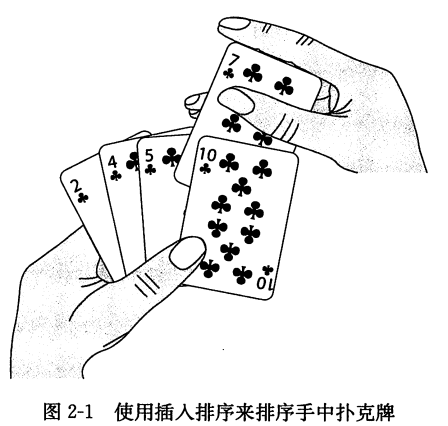

算法    | 最坏情况运行时间 | 平均/期望运行时间
--------|---------------|---------------
插入排序 | Θ(n\*\*2)     | Θ(n\*\*2)
归并排序 | Θ(nlgn)       | Θ(nlgn)
冒泡排序 |        |
选择排序 |        |
堆排序   |            |
快速排序 | Θ(n\*\*2)     | Θ(nlgn)
计数排序 |            |  
基数排序 |            |
桶排序   |            |

### 1.插入排序
  * 思路：类似于抽牌的过程，右手一张张地抽牌，每次右手抽的牌对比左手中已经排序好的牌，放在左手相应的位置中
  <!--  -->

```python
  def sort_insert(lista):
    for i in xrange(1, len(lista)): # 右手抽的牌
        right_num = lista[i]
        j = i #左手边起始对比的位置
        while (j > 0) and (lista[j-1] > right_num): # 左边比较大的时候
            lista[j] = lista[j-1] # 坐标的数字往后移
            j -= 1
        lista[j] = right_num
    return lista

```
### 2.归并排序
  * 思路:
    1. 将数组划分为2个排好顺序的数组A和B
    2. 每次从2个数组中抽出一个最小的放在另一个数组C中，直到A、B其中一个数组被取完，将A、B中未取完的数组放入C中

  ```python
  def sort_merge(lista):
      def compare(A, B): #步骤2
          result = []
          i, j = 0, 0
          while i < len(A) and j < len(B):
              if A[i] < B[j]:
                  result.append(A[i])
                  i += 1
              else:
                  result.append(B[j])
                  j += 1
          result.extend(A[i:])
          result.extend(B[j:])
          return result

      def merge(lista): #步骤1，将数组分为2个数组A,B
          if len(lista) == 1:
              return lista
          else:
              mid = len(lista) // 2
              left = merge(lista[:mid])
              right = merge(lista[mid:])
              return compare(left, right)
      return merge(lista)
  ```

### 3.冒泡排序
