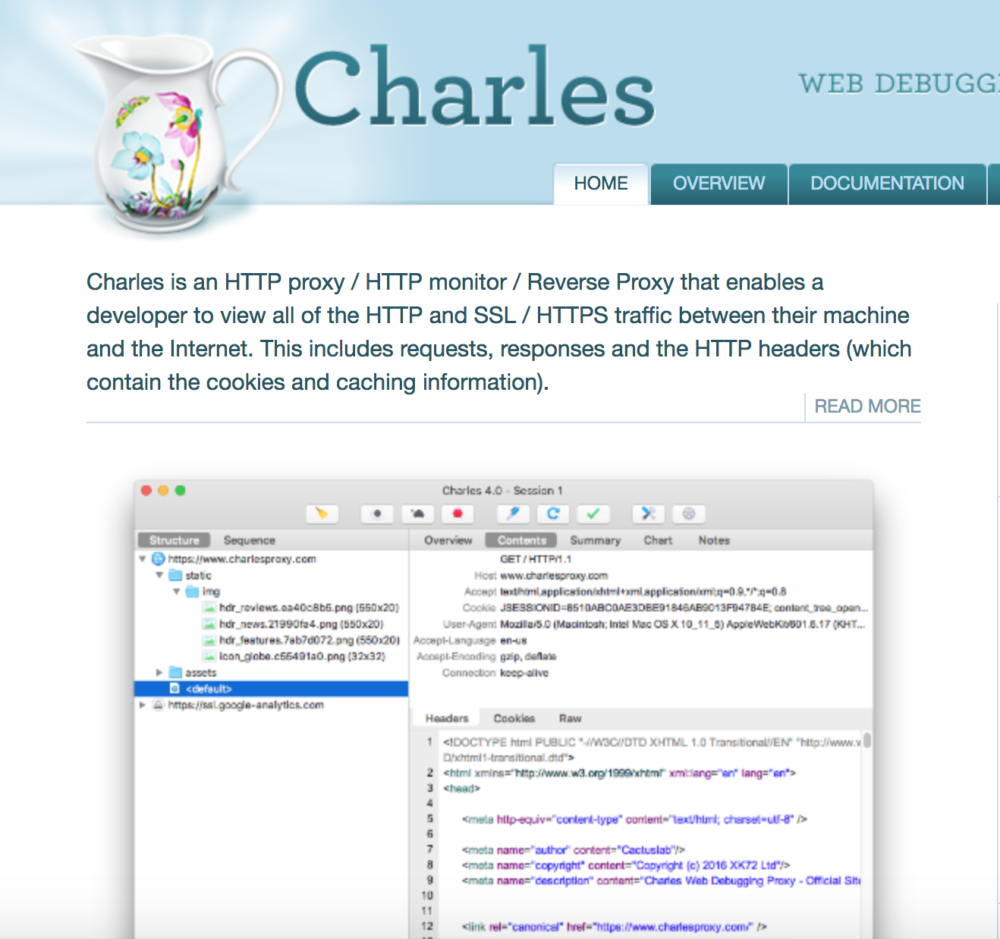

## 1.起因
因为另一个JR的帖子。看了他的[github项目](https://github.com/chenjiandongx/HupuLive),发现很厉害。不过他的文字直播只是简单的比赛进程。不是虎扑App的文字直播。没办法看到来自三分剑地狱的火焰啊！所以我就想做一个虎扑App的文字直播的命令行版

## 2.开始
最开始当然是先抓包.手机抓包用的是[Charles](https://www.charlesproxy.com/).



不过抓包的过程中发现,文字直播的内容只有进入文字直播的页面的时候才会获取一次所有数据。后续的直播内容没有抓包成功。这里就卡住了。不知道怎么回事。
后来才知道这是因为Charles只抓取了http, 并没有抓取所有的socket包。
但是自己自学编程, 对于基础知识部分几乎都是空白。所以只好一边搜索一边尝试抓取socket

## 3.使用`Charles`抓取http接口

### 3.1.http接口传参规则
虎扑的http接口传参一般为
```
{
      'crt': 1517468711881,
      'night': 0,
      'channel': 'myapp',
      'client': clientid,
      'time_zone': 'Asia/Shanghai',
      'android_id': android_id,
      'sign': '7815696ecbf1c96e6894b779456d330e'
  }
```
### 3.2.client_id
其中`client`是手机的Imei。
> IMEI就是移动设备国际身份码，我们知道正常的手机串码IMEI码是15位数字，
    由TAC（6位，型号核准号码）、FAC（2位，最后装配号）、SNR（6位，厂商自行分配的串号）和SP（1位，校验位）。

其中`tac`搜索后找到了一个数据表,[地址](https://www.kaggle.com/sedthh/typeallocationtable/data)

### 3.3.android_id

>随机64位数字的16进制

### 3.4.sign
这个参数一看就像是md5值。不过不清楚是哪个的md5值。经验告诉我是其他参数排序后的MD5值。不过结果不对。纠结了好久。想想估计是加salt了。于是卡主了。不晓得该怎么办了.然后没办法开始反编译hupu apk的旅途。


## 3.反编译Apk

下载虎扑android app解压后看到3个dex文件, classes.dex, classes2.dex, clsses3.dex
继续搜索之后。使用`jdax`
```
brew install jadx

jadx classes.dex -d classes
jadx classes2.dex -d classes2
jadx classes3.dex -d classes3
# 然后开始找salt
find . | xargs grep -nr 'SALT'
```
幸运的是一下子我就找到了一个参数`HUPU_SALT`。
加入进去之后sign结果正确
最后`sign`的生成方法就是
```
def getSortParam(**kwargs):
    result = ''
    kwargs_sorted = sorted(kwargs)
    for key in kwargs_sorted:
        if len(result) > 0:
            result += '&'
        result += '='.join((key, str(kwargs.get(key))))
    result += HUPU_SALT
    return md5(result.encode('utf8')).hexdigest()
```


## 4.socket 和 websocket

  待填写


## 5.抓取socket
使用安卓模拟器 [网易MuMu](http://mumu.163.com/) , 编译好的[tcpdump](https://www.androidtcpdump.com/)二进制文件, 和 [wireshark](https://www.wireshark.org/), 配合adb进行抓取

> 如果想要修改模拟器的网络设置
>
>```adb shell am start -a android.intent.action.MAIN -n com.android.settings/.wifi.WifiSettings```

但是直接`adb device`看不到模拟器,搜索之后发现需要手动连接
搜索之后全局查找myandrovm_vbox86.nemu,
最后在Library/Nemu/vms/myandrovm_vbox86找到了.
在文件中搜索ADB_PORT, 发现了端口5555
然后
```shell
adb connect 5555
adb device  # 查看是否连接成功
adb push tcpdump /sdcard/

adb shell
su  # 提权为 root
cp /sdcard/tcpdump /data/local/
chmod 777 /data/local/tcpdump # 修改 tcpdump 执行权限

# 将抓到的包输出到 netCapture.pcap 文件中
/data/local/tcpdump -i any -p -s 0 -w /sdcard/data/netCapture.pcap

# 参数介绍
#
# -i: 指定监控的网络接口, any 表示监控所有端口.
# -p: 将网络接口设置为非“混杂”模式.
# -s: 指定抓取网络请求返回的大小,0 表示抓取整个网络包.
# -w: 指定数据包写入文件的位置.

# 记录结束后将文件下载到电脑
adb pull /sdcard/data/netCapture.pcap ./
```

将文件导入`wireshark`

## 开始分析
筛选出websocket
发现大致的交互过程为:
```
# 连接部分
先获取token
connect:  附上token
receive:        1::

send:           2:::
receive:        2::

send:           1::/nba_v1
receive:        1::/nba_v1

send:           
5::/nba_v1:{"args":[{"roomid":-1,"gid":100721,"pid":429,"room":"NBA_PLAYBYPLAY_CASINO"}],"name":"join"}
receive:        直播数据

# 保持连接
receive:        2::
send:           2::

# 疑似还需要主动发送
send:           2:::
```

然后在github上找到了一个websocket客户端的库websocket-client.随后进行了连接客户端代码的编写
