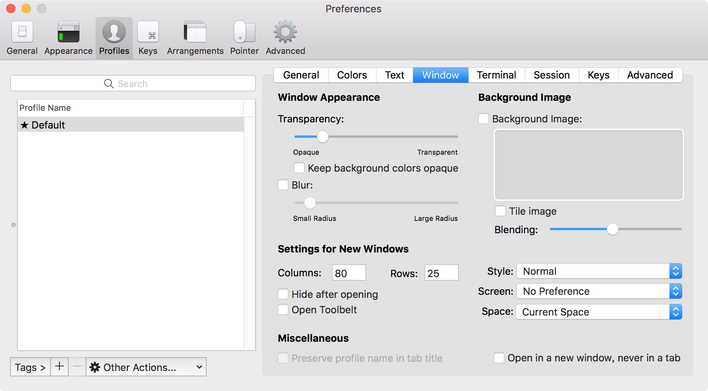
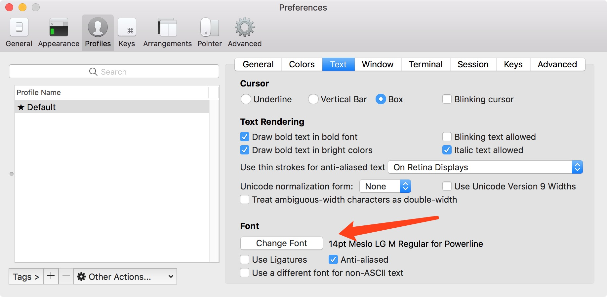
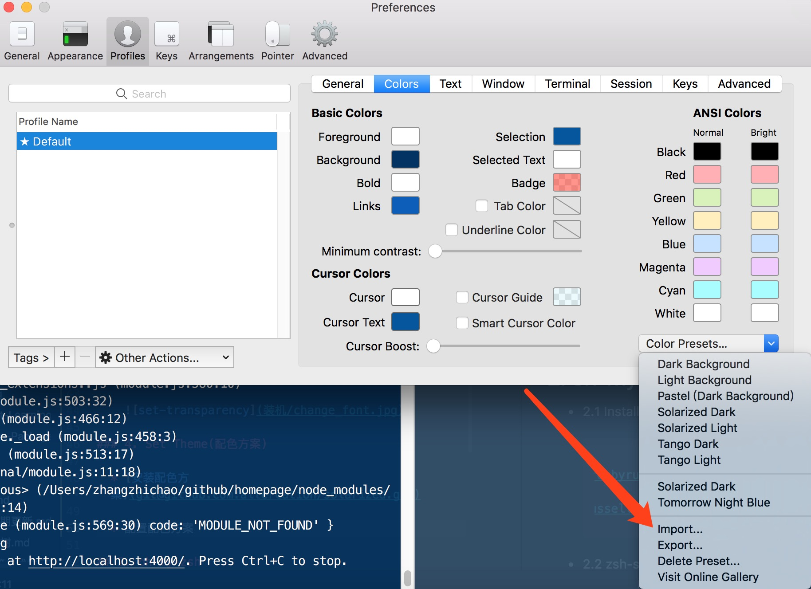

# 装机时候一些常用软件的安装


* iTerm
* oh-my-zsh
* brew
* pip
* virtualenv, virtualenvwrapper
* docker
* Atom, PyCharm
* mysql, redis

## 1. iTerm
### 1.1 下载安装

  &emsp;&emsp;去 [官网](http://www.iterm2.com/) 下载最新版本, 并安装

### 1.2 set Transparency
  

### 1.3 Set Font Style(下载、安装库字体库)

  * 1.3.1 拉取工程
    ```shell
    # https://github.com/powerline/fonts
    git clone git@github.com:powerline/fonts.git
    ```

  * 1.3.2 安装字体

    执行./install.sh指令安装所有Powerline字体
    安装完成后提示所有字体均已下载到/Users/superdanny/Library/Fonts路径下

  * 1.3.3 修改iterm设置

    

### 1.4 配色方案

  * [安装配色方案](git@github.com:altercation/solarized.git)

  * 配置配色方案

    


## 2. oh-my-zsh

### 2.1 Install oh-my-zsh
  ```shell
  # via curl
  sh -c "$(curl -fsSL https://raw.github.com/robbyrussell/oh-my-zsh/master/tools/install.sh)"
  # via wget
  sh -c "$(wget https://raw.github.com/robbyrussell/oh-my-zsh/master/tools/install.sh -O -)"
  ```

### 2.2 切换系统使用的shell
  * 通过 ***cat /etc/shells*** 命令可以查看当前系统可以使用哪些shell

  * 通过 ***echo $SHELL*** 命令可以查看我们当前正在使用的shell

  * 如果当前的shell不是zsh，我们可以通过 ***chsh -s /bin/zsh***  命令可以将shell切换为shell之zsh，终端重启之后即可生效。


### 2.3 使用主题(agnoster)

  * 下载[agnoster](https://github.com/fcamblor/oh-my-zsh-agnoster-fcamblor)主题

    到下载的工程里面运行install文件,主题将安装到~/.oh-my-zsh/themes目录下

  *  设置该主题

     进入~/.zshrc打开.zshrc文件，然后将ZSH_THEME后面的字段改为agnoster。ZSH_THEME="agnoster"（agnoster即为要设置的主题）

### 2.4 语法高亮(zsh-syntax-highlighting)

  * cd到.zshrc所在目录

  * 执行指令将工程克隆到当前目录
    ```shell
    git clone git://github.com/zsh-users/zsh-syntax-highlighting.git
    ```

  * 打开.zshrc文件，在最后添加下面内容

      plugins=(git zsh-syntax-highlighting)

      保存文件。
